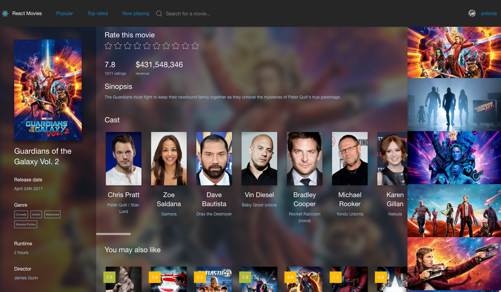
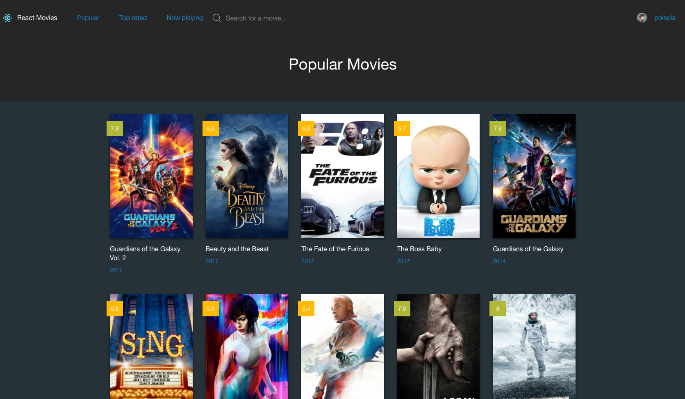

# Movies React
Learning project for React & Webpack 

## Introduction
The project uses the [TheMovieDB API](https://developers.themoviedb.org) to get all the info

## Features
- Based on [Foundation Sites](http://foundation.zurb.com/sites/docs/)
- SCSS: All styles are written in SCSS following BEM standards
- React Router is used to create a basic navigation

## What endpoints are implemented?
- The basic movie list endpoints (Popular, Top rated, Now playing)
- Movie detail with crew, images, similar movies
- Rating system: You can log in with your TheMovieDB account and rate movies, also check your previous ratings

## Installation

Clone or download the repository on your theme folder
```
https://github.com/polsola/movies-react
```

Navigate to the folder with terminal and run
```
yarn install
```

Copy [.env.example](./env.example) and rename it to `.env` you need to set your own [API_KEY](https://developers.themoviedb.org/3/getting-started)

To start the project just run

```
yarn start
```

## Screenshots




Styles inspired by some Dribble shots like [Cineplex Experience](https://dribbble.com/shots/2338485-Cineplex-Experience) by Dejan Markovic and [Movie Application UI](https://dribbble.com/shots/2759291-Movie-Application-UI) by Ricardo Salazar